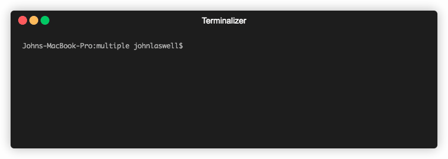

# compote
bite-sized dependency management for PHP



## 🚀 Try it now

```sh
docker run -it $(pwd):/app jlaswell/compote install
```

## About
First things first; compote is not designed as a replacement for [composer](https://github.com/composer/composer)
but as a compliment for specific use-cases. (While you're here, why not consider heading over there and supporting?)

compote is designed as a subset implementation of composer commands. Currently, it can install locked dependencies and show locked dependencies for a project.

If you don't have one of the following use-cases, then composer will continue to serve you well. This project is still very much a work-in-progress, but it works well enough for my use-cases at this point. Expect things to change a lot moving towards v1.

You might consider compote in favor of composer when trying to speed-up CI pipelines and automated workflows or when working within a memory constrained environment.

For now, you should stick with composer when adding or removing packages, updating dependencies, and (at this point) even generating autoloading!

## Installation

### Locally

Here's a snippet to run compote locally via a container until there is a better process for binaries.
```sh
$ alias dcompote='docker run -it $(pwd):/app jlaswell/compote'
$ dcompote install
```
Your `composer.lock` file is expected to be present within the current directory when running `dcompote`.

### Within CI

When using an automated workflow, I suggest mounting your project to `/app` in the `jlaswell/compote` container and running `install`. Remember, compote doesn't handle autoloading yet! so you will still need to rely on composer. Here's an example workflow:

```sh
docker run -it $(pwd):/app jlaswell/compote install
composer dump-auto
```

## Usage
```sh
Usage:
  compote [command]

Available Commands:
  help        Help about any command
  install     Install packages locked to this project
  show        Display information about packages

Flags:
      --config string     Config file (default is $HOME/.compote.yaml)
  -f, --filepath string   Path to the directory or composer file to work from (default ".")
  -h, --help              help for compote
  -q, --quiet             Do not write any output

Use "compote [command] --help" for more information about a command.
```

## Issues and Contributions

Issue reporting and contributes are very welcomed! You can see the current state of work in the [projects section](https://github.com/jlaswell/compote/projects). While I'd like to keep the scope of compote rather narrow, if you have a feature request or idea on how to improve compote, please [open an issue](https://github.com/jlaswell/compote/issues/new/choose) and use the appropriate labels or submit a pull request.
